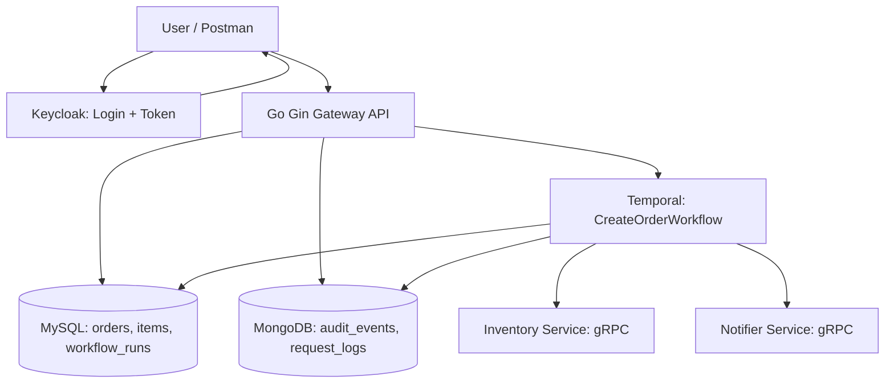
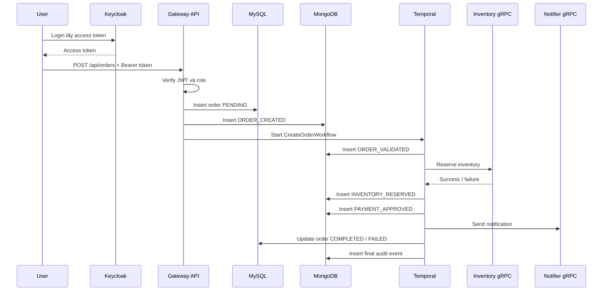

# Report research backend stack playground

## 1. Tình hình hiện tại

Tụi em đã dựng xong một playground backend-only để research các thành phần chính trong stack: Go Gin, MySQL, MongoDB, Keycloak, Temporal, HTTP/gRPC và Docker Compose.

Playground chạy theo flow mini Order System: user đăng nhập qua Keycloak, gọi API tạo order, lưu dữ liệu vào MySQL, ghi audit event vào MongoDB, start Temporal workflow và gọi các internal service qua gRPC.

## 2. Các thành phần đã research

- Go Gin: routing, middleware, request context, handler, graceful startup.
- Keycloak: realm, client, user, role, access token, JWT verification, OIDC/OAuth2 flow.
- MySQL: lưu dữ liệu nghiệp vụ chính như orders, order_items, workflow_runs.
- MongoDB: lưu audit_events và request_logs.
- Temporal: workflow orchestration, activity, retry, workflow history, debug workflow stuck/fail.
- gRPC: giao tiếp nội bộ giữa gateway và inventory/notifier service.
- Docker Compose: dựng local environment gồm nhiều service riêng biệt.

## 3. Kiến trúc hiện tại

## 4. Flow tạo order

## 5. Port và màn hình cần quan tâm

- 8080: Gateway API, dùng để test business API.
- 8081: Keycloak UI/API, dùng để quản lý user, role, client và debug auth.
- 8088: Temporal UI, dùng để xem workflow, activity, retry và failure.
- 7233: Temporal server, service nội bộ dùng để kết nối Temporal.
- 3306: MySQL.
- 27017: MongoDB.
- 9091: Inventory gRPC service.
- 9092: Notifier gRPC service.

## 6. Các lỗi đã gặp và bài học

- PowerShell chặn chạy script ps1 do execution policy.
- Docker daemon chưa chạy nên không truy cập được container.
- MySQL client báo Public Key Retrieval is not allowed khi connect bằng GUI/JDBC.
- Keycloak có master realm và order-playground realm; client order-playground-realm trong master là client quản trị nội bộ, không phải client business.
- Token issuer mismatch giữa localhost và hostname Docker, cần tách issuer URL và JWKS base URL.
- Temporal namespace chưa ready khi gateway start, cần retry lúc startup.
- Temporal activity name mismatch làm workflow retry mãi, cần đảm bảo tên activity workflow gọi khớp với tên worker đăng ký.

## 7. Kết quả hiện tại

- Docker Compose start được stack.
- Gateway health check OK.
- Lấy token user/admin từ Keycloak OK.
- Tạo order OK.
- Workflow Temporal chạy từ PENDING sang COMPLETED.
- Audit events ghi đủ các bước: ORDER_CREATED, ORDER_VALIDATED, INVENTORY_RESERVED, PAYMENT_APPROVED, ORDER_COMPLETED.

## 8. Hướng tiếp theo

- Bổ sung report/code walkthrough chi tiết hơn cho từng thành phần.
- Thêm test case workflow FAILED bằng inventory reject.
- Có thể tách Temporal worker ra service riêng để giống production hơn.
- Có thể thêm Postman collection hoặc script inspect DB để demo nhanh hơn.

